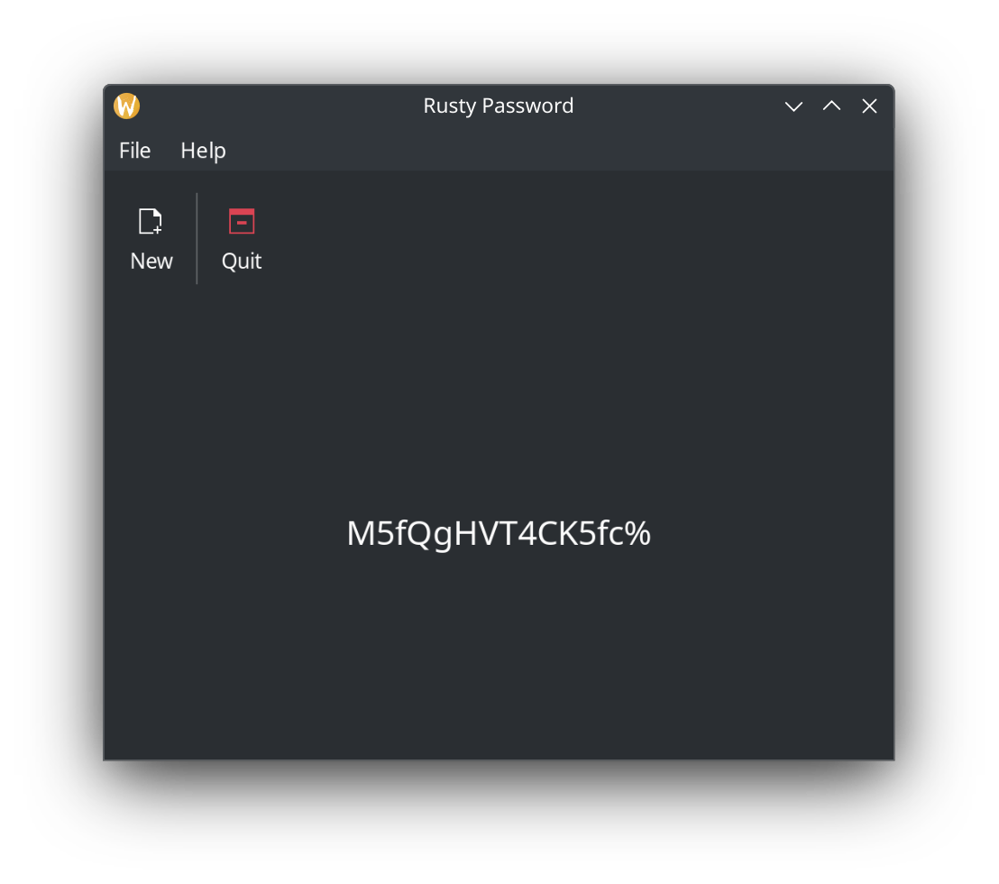

# Rusty-Password
A strong password generator written in Rust.

This is a small project to learn Rust and how to use GTK bindings.  This can run as a command line tool, or as a GUI.  

In CLI mode:

```
Options:
  -l, --length <LENGTH>  length of password to create [default: 15]
  -s, --simple           simplify possible characters
  -g, --gui              Enable GUI
  -h, --help             Print help
  -V, --version          Print version
```
The "--simple" option removes some characters that can cause issues with some password validator tools.

## Screenshot




TODO:
- [x] Increase the font size of the password
- [x] Make sure password contains at least one of each char type
- [x] Add button to generate a new password
- [ ] Auto-add the generated password to the clipboard
- [ ] Add GUI option to alter password length
- [ ] Add GUI option for simple vs complex passwords
- [ ] Add db for storing passwords usernames and urls

## Thanks
Thanks to https://github.com/pjmlp/gwc-rs/ for showing the way forward with the GUI